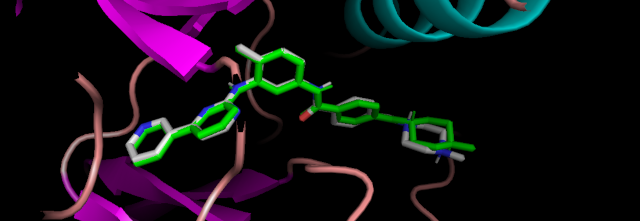

Docking using demo [files](https://github.com/dualword/AutoDock-Vina/tree/29b388fc89e6230a5f73602764bcf9c9824f6937/example/basic_docking/solution).

mode |   affinity | dist from best mode  
     | (kcal/mol) | rmsd l.b.| rmsd u.b.  
-----+------------+----------+----------  
   1        -13.3      0.000      0.000  
   2        -11.3      2.964     12.404  
   3        -11.0      3.672     12.385  

