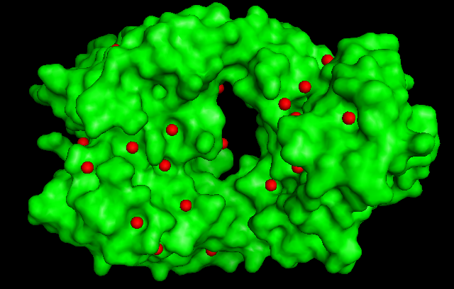

Fig.5

ATOM      1  Fe  PKT Z 629      -4.051   5.174  69.307

ATOM      2  Fe  PKT Z 142      -2.514  10.618 101.714

ATOM      3  Fe  PKT Z 137     -17.060  -2.087  57.359

ATOM      4  Fe  PKT Z 110      -9.841  -0.268  42.958

ATOM      5  Fe  PKT Z 102       8.305   6.887  79.092
