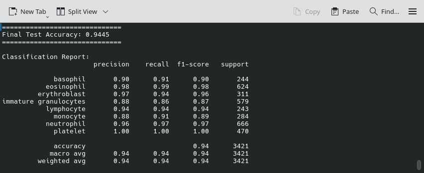
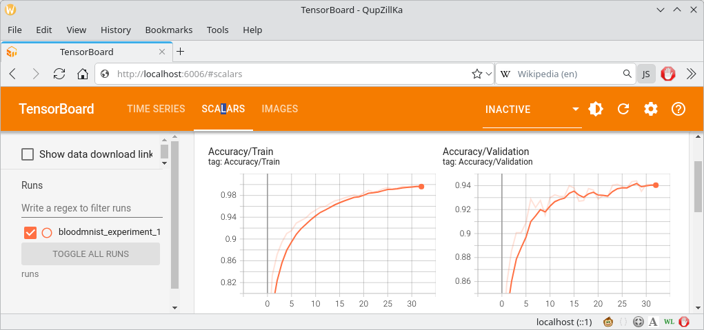
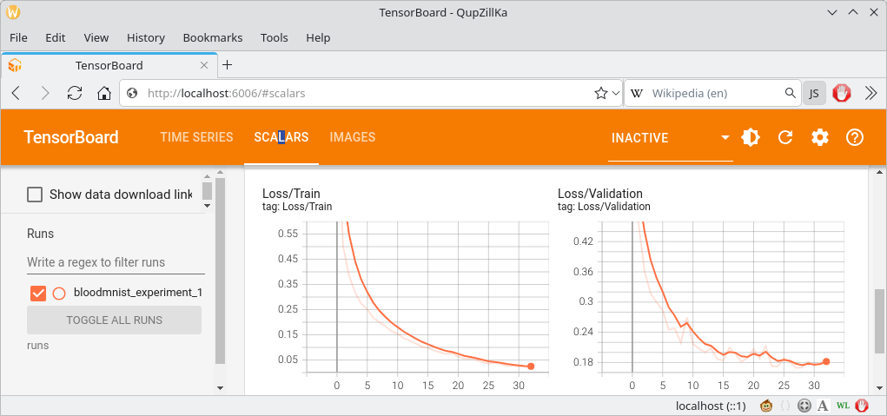
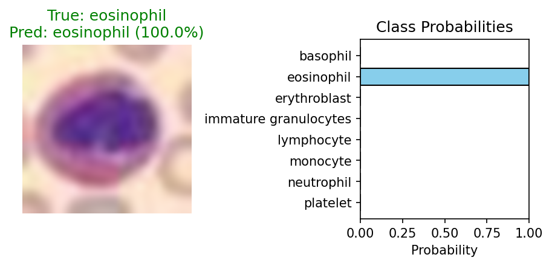
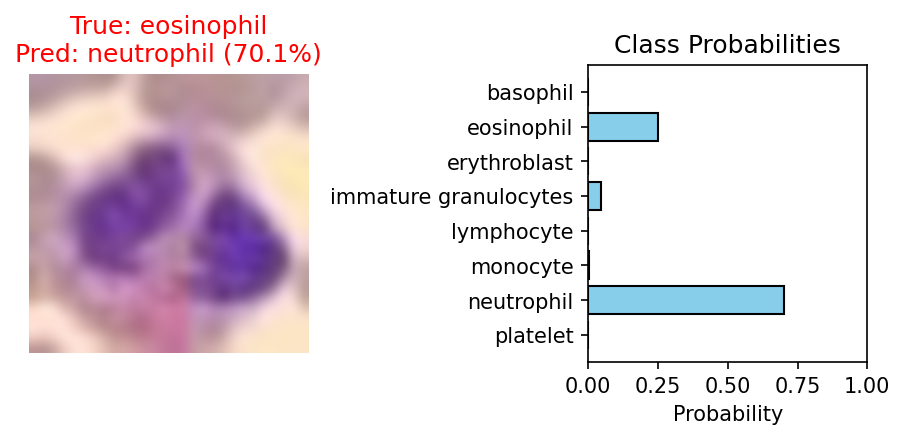

Peripheral blood cell images recognition using PyTorch, MedMNIST (BloodMNIST).  

Training dataset contains 17000+ microscopic peripheral blood cell images and contains the following eight groups: neutrophils, eosinophils, basophils, lymphocytes, monocytes, immature granulocytes (promyelocytes, myelocytes, and metamyelocytes), erythroblasts and platelets or thrombocytes.  

### Table of contents:
- [Project 1](#Project1)

## Project1

Lightweight custom CNN with 28x28 image resolution and Cross-Entropy loss.  

